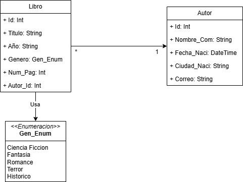
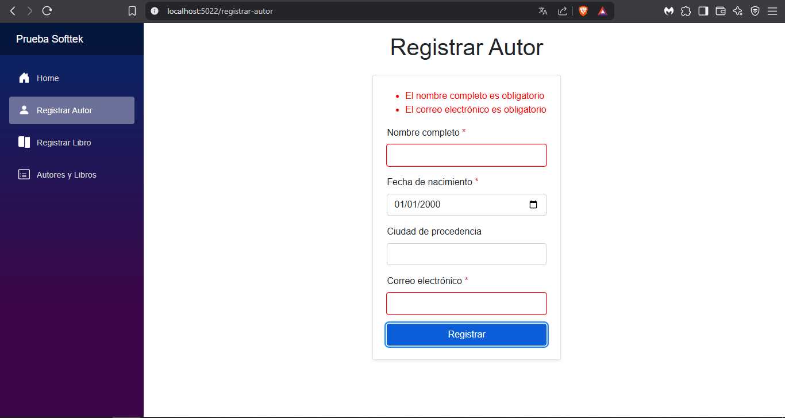
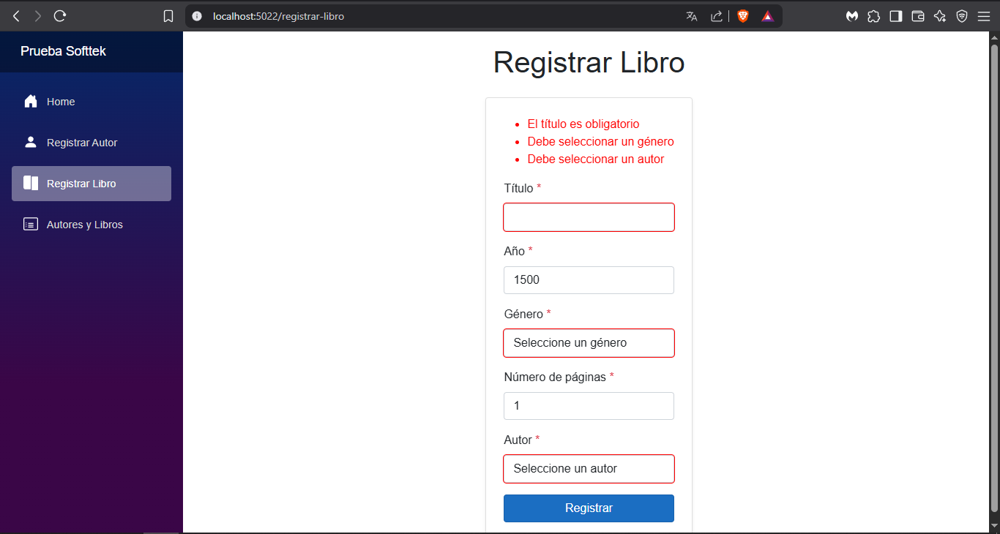
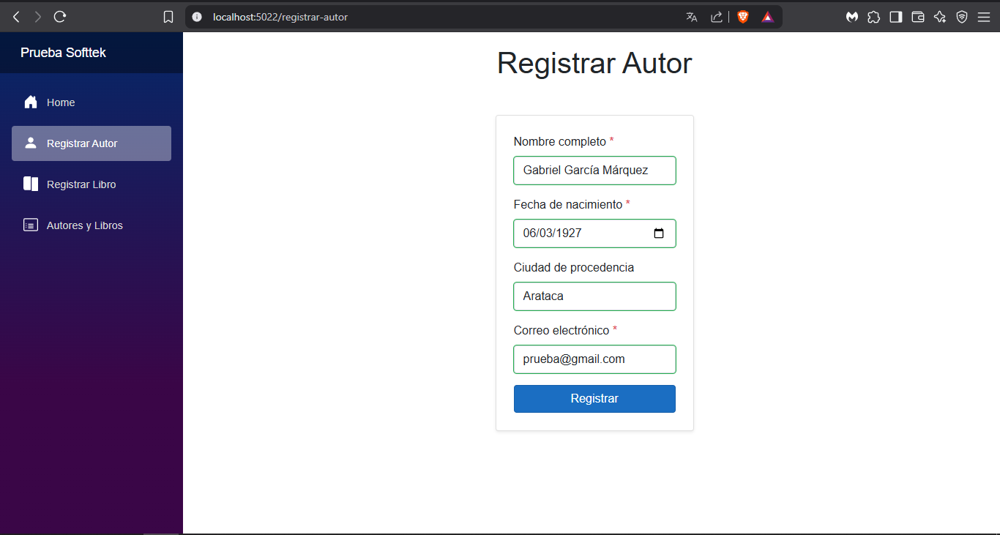
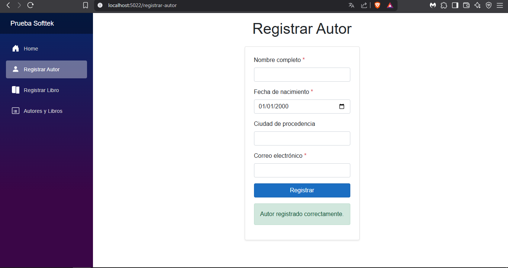
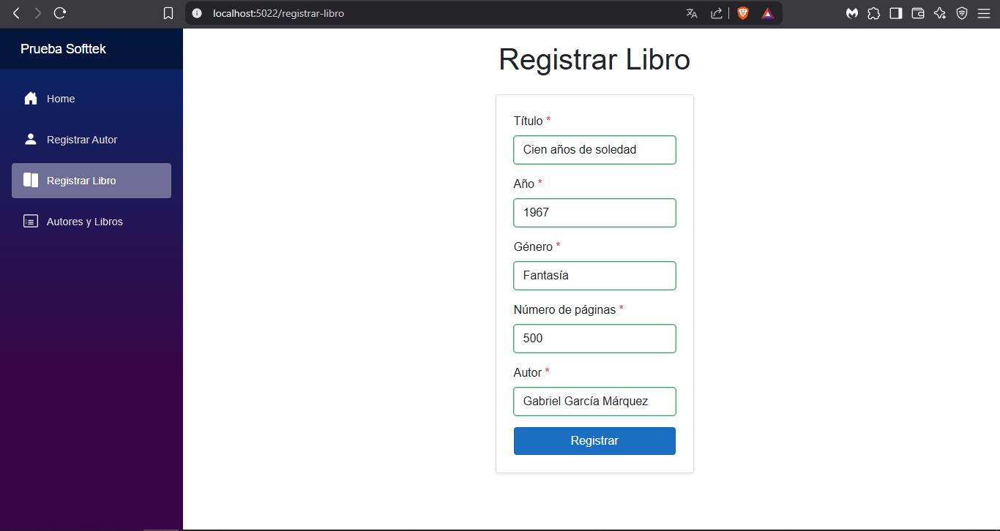
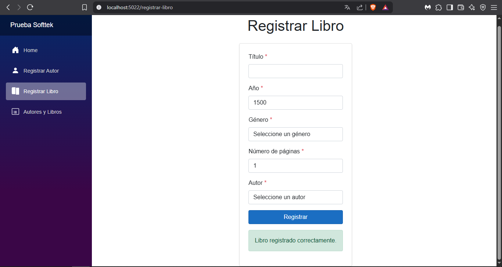
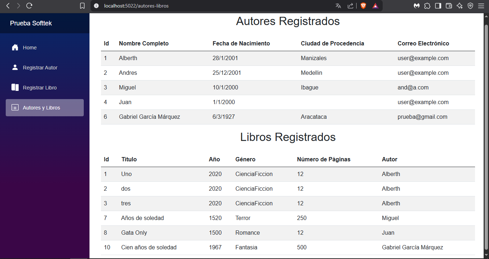
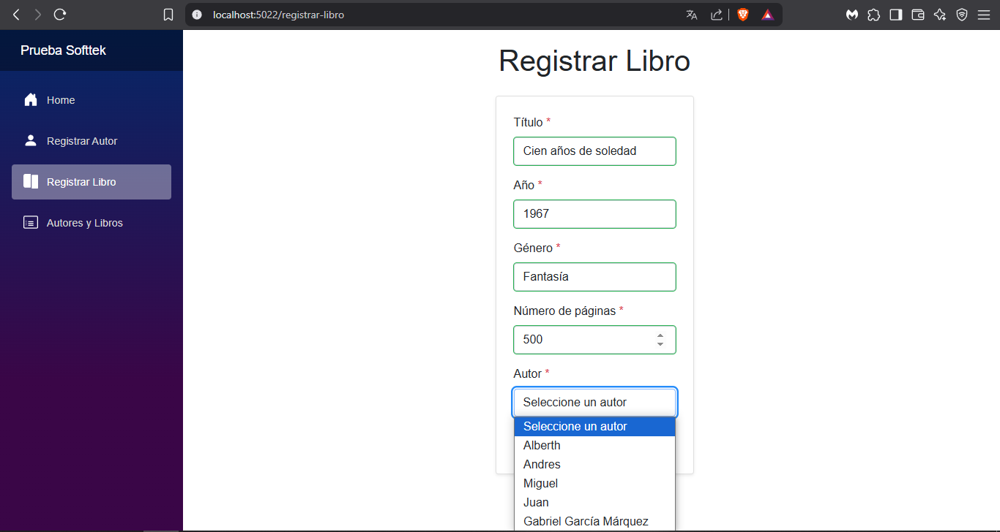
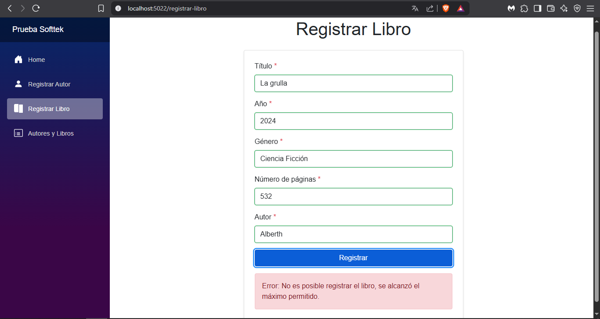

# Prueba Técnica .NET Junior - Softtek

## Descripción

Este proyecto es una solución para la prueba técnica de desarrollador .NET (Backend Junior) solicitada por Softtek.  
Permite registrar y consultar autores y libros, cumpliendo reglas de negocio específicas y buenas prácticas de desarrollo en C# y .NET.

---

## Diagrama de Clases
> 

---

## Estructura del Proyecto

```
PruebaSofttek/           # Backend (.NET API)
│
├── Controllers/         # Controladores de la API
├── Models/
│   ├── Entities/        # Entidades de dominio (Autor, Libro, etc.)
│   ├── DTOs/            # Data Transfer Objects
│   └── Enums/           # Enumeraciones (por ejemplo, Género)
├── Repositories/        # Interfaces y repositorios de datos
├── Services/            # Lógica de negocio e interfaces de servicios
└── Program.cs           # Configuración principal y DI

PruebaFront/             # Frontend (Blazor WebAssembly)
│
├── Pages/               # Páginas Blazor (RegistrarAutor, RegistrarLibro, AutoresYLibros, etc.)
├── Models/DTOs/         # DTOs usados en el frontend
├── Layout/              # Componentes de layout y menú
└── wwwroot/             # Archivos estáticos y recursos
```

---

## Ejecución del Proyecto

### Requisitos

- .NET 6 o superior
- SQL Server (local o remoto)
- Visual Studio 2022 o superior (opcional, pero recomendado)

### Pasos

1. **Clona el repositorio**
2. **Configura la cadena de conexión** en `appsettings.json` del backend.
3. **Restaura paquetes y compila la solución:**
   ```bash
   dotnet restore
   dotnet build
   ```
4. **Ejecuta el backend:**
   ```bash
   dotnet run --project PruebaSofttek/PruebaSofttek.csproj
   ```
5. **Ejecuta el frontend:**
   ```bash
   dotnet run --project PruebaFront/PruebaFront.csproj
   ```
6. **Accede a la aplicación Blazor** en tu navegador (por ejemplo, http://localhost:5000).

---

## Evidencias de la Interfaz

A continuación se muestran capturas de pantalla de la aplicación web, evidenciando las principales funcionalidades y validaciones:

### 1. Validación de campos obligatorios




### 2. Creación exitosa de un autor y un libro

**a) Datos ingresados en el formulario de autor:**
*Se muestra el formulario de registro de autor con los campos llenos.*


**b) Mensaje de creación exitosa de autor:**
*Mensaje verde indicando que el autor fue registrado correctamente.*


**c) Datos ingresados en el formulario de libro:**
*Se muestra el formulario de registro de un libro con los campos llenos.*


**d) Mensaje de creación exitosa de libro:**
*Mensaje verde indicando que el libro fue registrado correctamente.*


### 3. Visualización de autores y libros registrados


### 4. Lista de autores en el registro de un libro


### 5. Mensaje de excepción por regla de negocio

---

## Pruebas Realizadas en el Frontend

Se realizaron pruebas manuales para validar la funcionalidad y el manejo de errores:

- **Registro de autores:**  
  - Validación de campos obligatorios y formato de correo.
  - Restricción de longitud de campos.
  - Mensajes claros de éxito y error.

- **Registro de libros:**  
  - Validación de selección de género y autor.
  - Validación de año y número de páginas.
  - Mensajes de error si se supera el máximo de libros por autor o si el autor no existe.

- **Visualización:**  
  - Tablas de autores y libros con datos actualizados.
  - Mensajes informativos si no hay registros.

- **Manejo de errores:**  
  - Se muestran mensajes rojos para errores y verdes para éxitos.
  - Se validan reglas de negocio tanto en frontend como en backend.

---

## Reglas de Negocio Implementadas

- Todos los campos marcados con asterisco (*) son obligatorios.
- No se permite registrar un libro si se supera el máximo permitido por autor.
- No se permite registrar un libro si el autor no existe.
- Validaciones de integridad y formato en todos los campos.

### Restricciones de los campos

#### Autor
- **Nombre completo:** obligatorio, máximo 100 caracteres.
- **Fecha de nacimiento:** obligatoria, debe estar entre 1900 y 2024.
- **Ciudad de procedencia:** opcional, máximo 100 caracteres.
- **Correo electrónico:** obligatorio, formato válido y máximo 100 caracteres.

#### Libro
- **Título:** obligatorio, máximo 200 caracteres.
- **Año:** obligatorio, debe estar entre 1500 y 2024.
- **Género:** obligatorio (debe seleccionarse, no puede ser 0).
- **Número de páginas:** obligatorio, mayor a 0.
- **Autor:** obligatorio (debe seleccionarse, no puede ser 0).

---

## Notas Técnicas

- **Inyección de dependencias** en backend para servicios y repositorios.
- **DTOs** para separar entidades de dominio y datos expuestos.
- **Validaciones** en backend y frontend usando DataAnnotations y validación manual donde es necesario.
- **Manejo de excepciones** y mensajes claros para el usuario.
- **Estructura limpia y modular** siguiendo buenas prácticas de .NET.
- **Configuración del máximo de libros por autor:** El valor se define en `appsettings.json` bajo la clave `MaxLibrosPorAutor` (por defecto es 3).
- **Uso de URLs relativas en el frontend:** Se recomienda configurar correctamente el `BaseAddress` de `HttpClient` para evitar problemas al cambiar de entorno.
- **DTOs en el frontend:** Los modelos de datos usados en los componentes Blazor deben estar en la carpeta `Models/DTOs` para facilitar la reutilización y el mantenimiento.
- **Manejo de errores y feedback visual:** El frontend maneja errores de red y muestra mensajes claros al usuario. Se recomienda implementar feedback visual (spinners, mensajes de carga) para mejorar la experiencia de usuario.
- **Mejoras futuras:** Para grandes volúmenes de datos, se recomienda implementar paginación o carga progresiva en las tablas.
- **Seguridad y validaciones:** Aunque existen validaciones en el frontend, la integridad y seguridad de los datos siempre se garantiza en el backend.

> **Nota sobre el registro de libros:**  
> En la interfaz de usuario para registrar un libro, se muestra una lista desplegable con los autores ya registrados, lo que evita que el usuario intente asociar un libro a un autor inexistente.  
> Sin embargo, la validación en el backend permanece activa para garantizar la integridad de los datos, incluso si se intenta registrar un libro con un autor no existente mediante herramientas como Swagger u otros clientes externos.

---

## Consideraciones y Limitaciones

- El frontend no incluye edición ni eliminación de registros (solo alta y consulta).
- El sistema asume que la base de datos está correctamente configurada y migrada.
- Las validaciones de fechas se realizan manualmente en el frontend para evitar problemas de formato con DataAnnotations.
- El máximo de libros por autor está configurado en el backend y puede modificarse en la configuración.

---

## Probar la API

El backend expone Swagger para pruebas manuales de los endpoints:
- Accede a [http://localhost:5178/swagger](http://localhost:5178/swagger) para ver y probar los endpoints de la API.

---

## Tecnologías Utilizadas

- .NET 6 (C#)
- ASP.NET Core Web API
- Entity Framework Core
- SQL Server
- Blazor WebAssembly
- Bootstrap 5

---

## Contacto

Desarrollado por: _Alberth Yecid Cifuentes Pulgarin_  
Correo: _alberthpulgarin@gmail.com_  
Año: 2025

---
